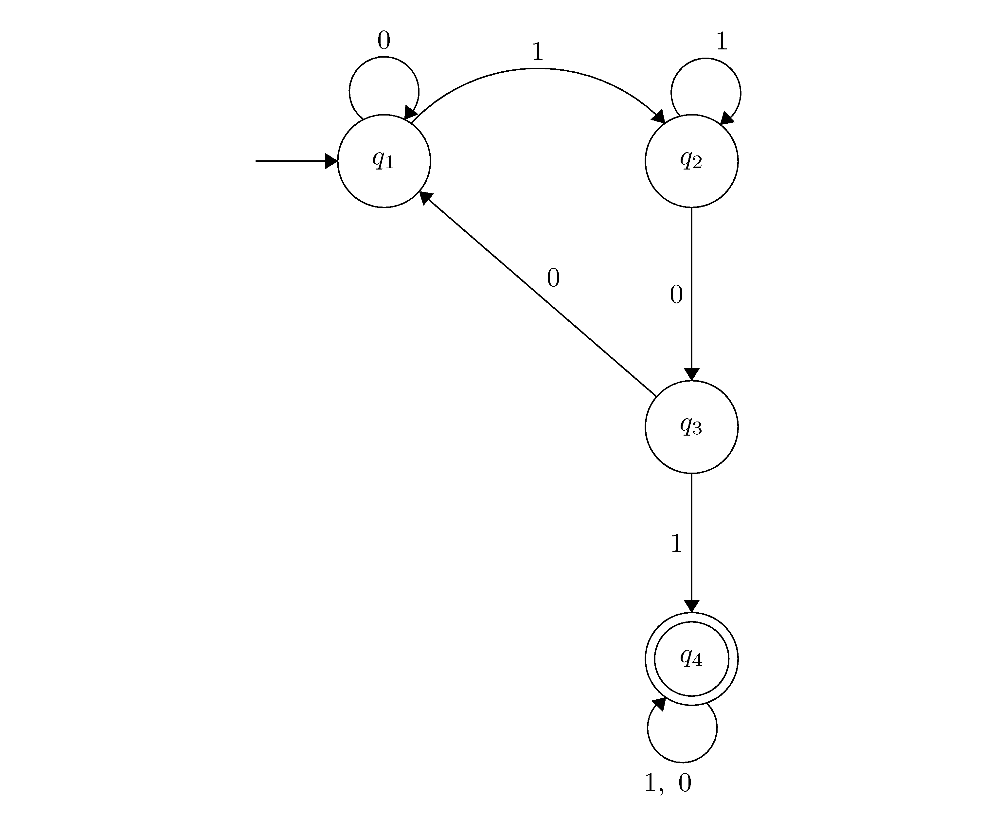
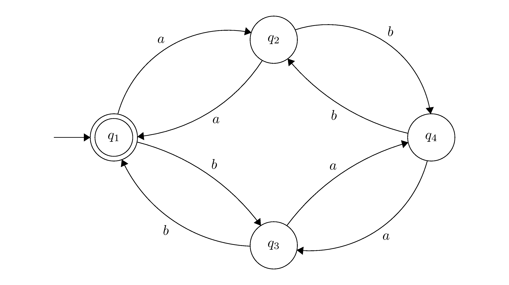

# Inferrer: A library for automata learning

## About Inferrer
Inferrer is an automata learning library written in Python. The library can be
used to learn the grammar of a regular language from a given set of example strings
or by systematically observing the behaviour of a target automaton and matching its behaviour. The
library implements 

* E. Mark GOLD's algorithm,
* The Regular Positive and Negative Inference (RPNI) algorithm,
* Dana Angluin's L* algorithm, and
* The NL* algorithm.

## Setup
If you do not have pipenv installed on your system, then run the following:
```bash
pip install --user pipenv 
```

If you want Inferrer to show you the DFA that was inferred by the different algorithms, then
you need to install [Graphviz](https://www.graphviz.org/) on your system. The following 
will work:

* Ubuntu: ```sudo apt-get install graphviz```
* Arch: ```sudo pacman -Syu graphviz```
* OSX: ```brew cask install graphviz```


Clone the repository, install the dependencies and then run the unit tests
```bash
$ git clone https://gitlab.com/steynvl/inferrer
$ cd inferrer
$ pipenv install
$ pipenv run python -m unittest discover
```
Since Inferrer is a library, you can import and use it in your own code, but the library
is also exposed via a CLI:
```bash
$ pipenv run python cli.py --help
```

Documentation for the library is located in docs/public/index.html.

## Examples

### Substring example

We want to try and learn the language A, where A is a binary string containing 101 as a substring.
In the resources directory, there is a file positive_01.txt, this file contains positive example
strings and a file negative_01.txt, which contains negative example strings.

We are going to try to learn this regular language using the RPNI algorithm:
```bash
pipenv run python cli.py resources/positive_01.txt resources/negative_01.txt rpni --show-dfa
```
RPNI then builds the following DFA



which is the correct grammar and thus we have successfully inferred the regular language A.
This DFA is then converted to the following regular expression:
```text
(11*00|0)*(11*(0(1(1|0)*)))
```

### Even occurrences
We want to try and learn the language L, where L is a language over the alphabet {a, b} where each string in L contains an even number of a's and an even number of b's.

We are going to try to learn this regular language using the RPNI algorithm:
```bash
pipenv run python cli.py resources/positive_02.txt resources/negative_02.txt rpni --show-dfa
```
RPNI then builds the following DFA



which is the correct grammar and thus we have successfully inferred the regular language L.
This DFA is then converted to the following regular expression:
```text
((ba(aa)*b|a)(b(aa)*b)*(b(aa)*ab|a)|ba(aa)*ab|bb)*
```

## Resources

* [Learning Regular Sets from Queries and Counterexamples](https://www.sciencedirect.com/science/article/pii/0890540187900526)
* [Angluin-Style Learning of NFA](https://www.aaai.org/ocs/index.php/IJCAI/IJCAI-09/paper/viewFile/550/932)
* [Grammatical Inference: Learning Automata and Grammars](http://www.cambridge.org/gb/academic/subjects/computer-science/pattern-recognition-and-machine-learning/grammatical-inference-learning-automata-and-grammars?format=HB#hUi22RWdy3vfxPdp.97)
